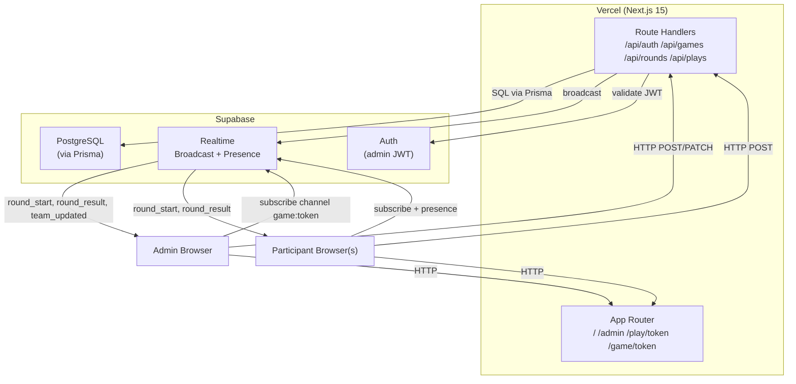
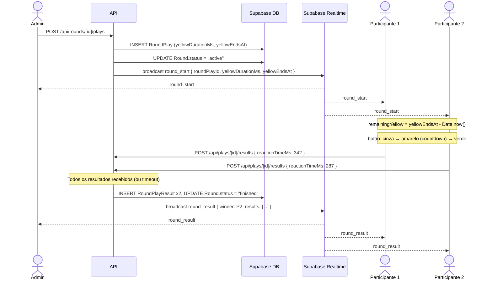
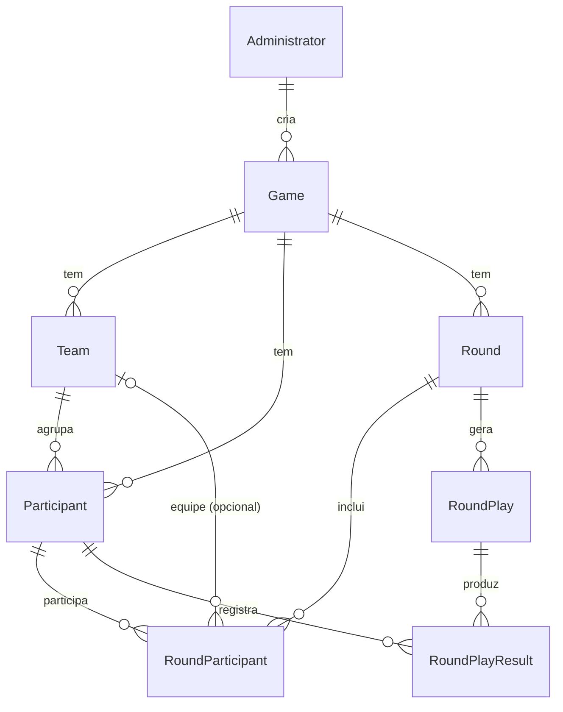
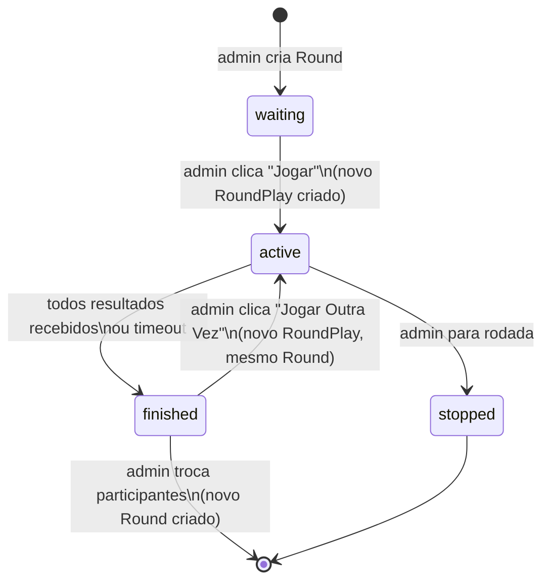
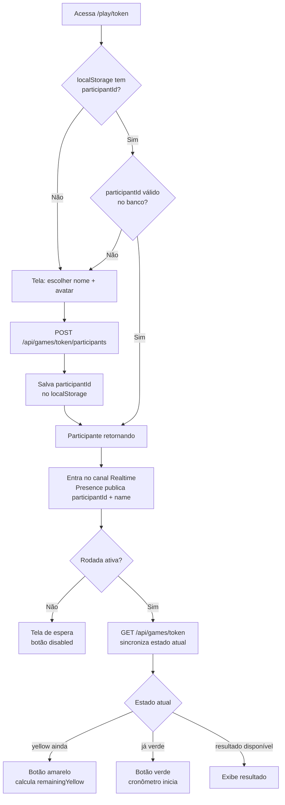
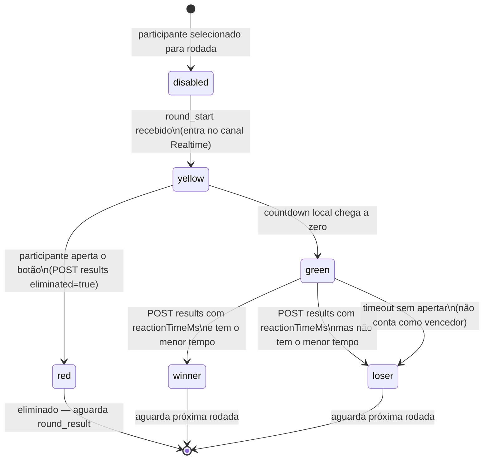

# Botão da Vez — Design Document

**Data**: 2026-03-14
**Versão**: 2.2 (diagramas Mermaid adicionados)
**Status**: Aprovado

---

## 1. Contexto

**Botão da Vez** é um app web/PWA de reação multiplayer para famílias decidirem "de quem é a vez" em jogos e brincadeiras. Cada participante tem um botão gigante na tela que passa por estados de cor (cinza → amarelo → verde), e vence quem apertar mais rápido no verde. O admin controla as rodadas via painel dedicado.

A implementação anterior foi descartada por problemas arquiteturais (uso de Socket.io com servidor customizado quebrando o modelo serverless, bugs nos fluxos de rodada, layout simplório). Esta versão começa do zero com decisões de stack corrigidas.

**Objetivo atual**: MVP funcional para validação com a família do Natan, rodando no Vercel Hobby (gratuito). Sem pressão de escala por enquanto.

---

## 2. Stack Técnica

| Camada | Tecnologia | Justificativa |
|---|---|---|
| Framework | Next.js 15 (App Router) | Vercel-native, serverless, SSR |
| Linguagem | TypeScript estrito | Type safety em todo o projeto |
| Estilo | TailwindCSS v4 + CSS customizado | Base utilitária + efeitos skeuomorphic |
| Real-time | Supabase Realtime (Broadcast + Presence) | Sem servidor custom — resolve o problema central da v1 |
| Banco | PostgreSQL via Supabase | Free tier generoso |
| ORM | Prisma | Migrations type-safe |
| Auth | Supabase Auth (admin only) | JWT + email/senha |
| Avatares | DiceBear API (client-side) | Sem dependência de servidor |
| PWA | @ducanh2912/next-pwa | Fork mantido, compatível com Next.js 15 |
| Temas | next-themes | Dark/light respeitando preferência do sistema |
| Testes | Vitest | Rápido, ESM nativo, compatível com Next.js 15 |
| Deploy | Vercel Hobby (gratuito) | Zero config, preview por branch |

**Participantes não têm conta** — nome + avatarSeed salvos em `localStorage` após entrar no game.

---

## 3. Arquitetura

### Estrutura de rotas

```
/                          → tela inicial (input de token)
/admin                     → login admin
/admin/dashboard           → lista de games do admin
/admin/game/[id]           → gerenciar game (participantes, equipes, rodadas)
/play/[token]              → entrada do participante (nome + avatar)
/game/[token]              → tela de jogo (botão ou espectador)
```

### Diagrama de arquitetura



### API Routes (Route Handlers)

Todas as rotas admin requerem JWT válido do Supabase Auth no header `Authorization: Bearer <token>`, validado via `createServerClient` do Supabase.

```
POST /api/auth/login                   → login admin (Supabase Auth)
POST /api/auth/logout                  → logout admin

POST /api/games                        → criar game (gera token 6 chars) [admin]
GET  /api/games/[token]                → validar token + buscar game [público]

POST /api/games/[id]/rounds            → criar rodada com participantes selecionados [admin]
PATCH /api/rounds/[id]/stop            → parar rodada manualmente [admin]

POST /api/rounds/[id]/plays            → iniciar jogada: sorteia yellowDurationMs,
                                         persiste RoundPlay, retorna { roundPlayId, yellowDurationMs, yellowEndsAt }
                                         [admin]

POST /api/plays/[id]/results           → participante envia resultado individual
                                         body: { participantId, reactionTimeMs? (null = eliminado) }
                                         [participante autenticado por participantId no localStorage]
```

### Diagrama de sequência — fluxo de uma jogada



**Regra importante**: `button_press` e `button_early_press` **não** são eventos Broadcast. O participante envia seu resultado diretamente via `POST /api/plays/[id]/results`. A API, após receber todos os resultados esperados (ou atingir timeout), calcula o vencedor e faz o Broadcast de `round_result` para todos.

### Real-time com Supabase Realtime

Canal por game: `game:{token}`

**Broadcast — apenas servidor → todos os clientes:**

| Evento | Quem envia | Payload |
|---|---|---|
| `round_created` | API após criar Round | `{ round, participants }` |
| `round_start` | API após criar RoundPlay | `{ roundPlayId, yellowDurationMs, yellowEndsAt }` |
| `round_result` | API após processar resultados | `{ winner, results, eliminated }` |
| `round_stopped` | API ao parar rodada | `{ roundId }` |
| `team_updated` | API ao alterar equipes | `{ teams }` |

> **Nota**: `yellowEndsAt` é um timestamp absoluto ISO 8601 gerado pelo servidor no momento de criar o RoundPlay. Cada cliente calcula `yellowEndsAt - Date.now()` para sincronizar o countdown local, eliminando clock skew entre dispositivos. Clientes com mais de 500ms de diferença recebem o botão verde/amarelo no estado corrente.

**Presence (online/offline):**
- Cada participante ao entrar no canal publica `{ participantId, name }`
- Status online/offline derivado automaticamente — sem persistir `is_online` no banco
- A API usa o Presence para validar que todos os selecionados estão online antes de permitir início de rodada

### Coleta de resultados e timeout

Após broadcast de `round_start`, a API abre uma janela de coleta:

1. Cada participante envia `POST /api/plays/[id]/results` individualmente
2. A API sabe quantos resultados esperar (quantidade de `RoundParticipant` da rodada)
3. Assim que **todos** os resultados chegarem, a API processa e faz broadcast de `round_result`
4. Se após `yellowDurationMs + 10000ms` (10s de margem) ainda houver participantes sem resultado, a API trata os ausentes como **sem resultado** (não contam como vencedor) e finaliza
5. Participante que cai da rede durante a rodada não bloqueia o resultado dos demais

---

## 4. Modelo de Dados

### Diagrama entidade-relacionamento



### Relacionamento Round × RoundPlay

- **`Round`** = a "partida" configurada pelo admin com um conjunto de participantes. Tem um `status` que reflete o estado geral.
- **`RoundPlay`** = uma "tentativa/jogada" dentro da partida. Cada vez que o admin clica "Jogar" (ou "Jogar Outra Vez" com os mesmos participantes), cria-se um novo `RoundPlay` sob o mesmo `Round`.
- Se o admin **troca os participantes** antes de jogar de novo, cria-se um novo `Round` (e consequentemente um novo `RoundPlay`).

**Transições de status do `Round`:**



| Status | Significado |
|---|---|
| `waiting` | Round criado, aguardando admin iniciar |
| `active` | RoundPlay em andamento |
| `finished` | Resultado apurado |
| `stopped` | Admin interrompeu manualmente |

```prisma
model Administrator {
  id           String   @id @default(uuid())
  email        String   @unique
  passwordHash String   @map("password_hash")
  createdAt    DateTime @default(now()) @map("created_at")
  games        Game[]

  // Administrator.id = Supabase Auth user.id (FK implícita para auth.users)
  // Registrado na tabela local para manter a relação com Games via Prisma
  @@map("administrators")
}

model Game {
  id           String        @id @default(uuid())
  token        String        @unique @db.VarChar(6)
  adminId      String        @map("admin_id")
  admin        Administrator @relation(fields: [adminId], references: [id])
  createdAt    DateTime      @default(now()) @map("created_at")
  updatedAt    DateTime      @updatedAt @map("updated_at")
  teams        Team[]
  participants Participant[]
  rounds       Round[]
  @@map("games")
}

model Team {
  id                String             @id @default(uuid())
  gameId            String             @map("game_id")
  game              Game               @relation(fields: [gameId], references: [id], onDelete: Cascade)
  name              String
  color             String             @db.VarChar(7)
  createdAt         DateTime           @default(now()) @map("created_at")
  participants      Participant[]
  roundParticipants RoundParticipant[]
  @@map("teams")
}

model Participant {
  id                String             @id @default(uuid())
  gameId            String             @map("game_id")
  game              Game               @relation(fields: [gameId], references: [id], onDelete: Cascade)
  teamId            String?            @map("team_id")
  team              Team?              @relation(fields: [teamId], references: [id], onDelete: SetNull)
  name              String
  avatarSeed        String             @map("avatar_seed")
  lastSeen          DateTime?          @map("last_seen")
  createdAt         DateTime           @default(now()) @map("created_at")
  roundParticipants RoundParticipant[]
  roundPlayResults  RoundPlayResult[]
  @@map("participants")
}

model Round {
  id                String             @id @default(uuid())
  gameId            String             @map("game_id")
  game              Game               @relation(fields: [gameId], references: [id], onDelete: Cascade)
  status            String             @default("waiting") @db.VarChar(20)
  // valores válidos: "waiting" | "active" | "finished" | "stopped"
  createdAt         DateTime           @default(now()) @map("created_at")
  roundParticipants RoundParticipant[]
  roundPlays        RoundPlay[]
  @@map("rounds")
}

model RoundParticipant {
  id            String      @id @default(uuid())
  roundId       String      @map("round_id")
  round         Round       @relation(fields: [roundId], references: [id], onDelete: Cascade)
  participantId String      @map("participant_id")
  participant   Participant @relation(fields: [participantId], references: [id], onDelete: Cascade)
  teamId        String?     @map("team_id")
  team          Team?       @relation(fields: [teamId], references: [id], onDelete: SetNull)
  @@map("round_participants")
}

model RoundPlay {
  id               String            @id @default(uuid())
  roundId          String            @map("round_id")
  round            Round             @relation(fields: [roundId], references: [id], onDelete: Cascade)
  yellowDurationMs Int               @map("yellow_duration_ms")
  yellowEndsAt     DateTime          @map("yellow_ends_at")
  // timestamp absoluto do servidor — usado pelos clientes para sincronizar countdown
  startedAt        DateTime          @default(now()) @map("started_at")
  finishedAt       DateTime?         @map("finished_at")
  results          RoundPlayResult[]
  @@map("round_plays")
}

model RoundPlayResult {
  id             String      @id @default(uuid())
  roundPlayId    String      @map("round_play_id")
  roundPlay      RoundPlay   @relation(fields: [roundPlayId], references: [id], onDelete: Cascade)
  participantId  String      @map("participant_id")
  participant    Participant @relation(fields: [participantId], references: [id], onDelete: Cascade)
  reactionTimeMs Int?        @map("reaction_time_ms")
  // null = eliminado ou sem resultado (timeout)
  eliminated     Boolean     @default(false)
  rank           Int?
  createdAt      DateTime    @default(now()) @map("created_at")
  @@map("round_play_results")
}
```

---

## 5. Papéis e Fluxos

### Papéis

| Papel | Auth | Descrição |
|---|---|---|
| Administrator | Supabase Auth (email/senha) | Cria games, controla rodadas |
| Participant | Sem conta — participantId + name no localStorage | Joga as rodadas |
| Spectator | Mesmo que Participant | Participante fora da rodada atual |

### Fluxo de entrada e reconexão do participante



### Identidade do participante e reconexão

- Ao entrar no game (`/play/[token]`), o participante escolhe nome + avatar. A API cria um registro `Participant` e retorna o `participantId`, que é salvo em `localStorage` junto com `avatarSeed` e `gameToken`.
- **Retorno ao jogo**: se `localStorage` contém um `participantId` válido para aquele token, o participante é tratado como retornando (re-entra no canal Presence sem criar novo registro).
- **localStorage limpo ou dispositivo diferente**: um novo `Participant` é criado. O registro anterior fica órfão no banco — isso é aceito no escopo do MVP.
- **Reconexão durante rodada ativa**: ao recarregar, o cliente consulta `GET /api/games/[token]` para obter estado atual (round status + roundPlay ativo), sincroniza o botão para o estado correto e re-entra no canal Presence.

### Fluxo principal (happy path)

```
Admin cria game → recebe token 6 chars → compartilha /play/ABC123
                                                 ↓
Participante acessa → escolhe nome + avatar → API cria Participant
→ participantId salvo no localStorage → entra no canal Realtime
                                                 ↓
Admin vê participantes online (via Presence) → seleciona quem joga
→ "Jogar" só ativo se todos selecionados estão presentes no Presence
                                                 ↓
Admin clica "Jogar" → API cria RoundPlay, sorteia yellowDurationMs,
calcula yellowEndsAt → broadcast round_start { roundPlayId, yellowDurationMs, yellowEndsAt }
                                                 ↓
[LOCALMENTE em cada dispositivo]
Cliente calcula: remainingYellow = yellowEndsAt - Date.now()
Botão: cinza → amarelo (countdown = remainingYellow) → verde (cronômetro inicia)
                                                 ↓
Verde: participante aperta → POST /api/plays/[id]/results { reactionTimeMs }
Amarelo: participante aperta → POST /api/plays/[id]/results { eliminated: true }
                                                 ↓
API coleta todos os resultados (ou timeout em yellowDurationMs + 10s)
→ calcula vencedor → persiste RoundPlayResult → broadcast round_result
→ atualiza Round.status para "finished"
                                                 ↓
Todos veem resultado → Admin: "Jogar Outra Vez" (novo RoundPlay, mesmo Round)
                    ou "Trocar participantes" (novo Round)
```

---

## 6. Estados do Botão

### Máquina de estados do botão



| Estado | Visual | Condição |
|---|---|---|
| `disabled` | Cinza apagado | Aguardando admin iniciar |
| `yellow` | Amarelo pulsante | Countdown local rodando |
| `green` | Verde vibrante | Cronômetro de reação ativo |
| `red` | Vermelho afundado | Apertou no amarelo — eliminado |
| `winner` | Verde dourado/brilhante | Menor tempo de reação |
| `loser` | Cinza escuro | Não foi o mais rápido |

### Regras de resultado

| Cenário | Resultado |
|---|---|
| Um participante com menor tempo | Vencedor |
| Dois ou mais com mesmo tempo | Empate |
| Todos eliminados (apertaram no amarelo) | Sem vencedor |
| Admin parou a rodada | Sem vencedor |
| Participante não enviou resultado (timeout) | Não conta como vencedor |

---

## 7. Sistema de Design (Skeuomorphic)

**Direção**: Hardware de áudio analógico — Teenage Engineering K.O. II, samplers, mesas de som. Não é flat design. É um equipamento físico que acontece de estar numa tela.

### Componentes base (construídos na Fase 1)

| Componente | Uso |
|---|---|
| `AnalogButton` | Botão com relevo, sombra interna/externa, chanfro. Base para o botão da rodada |
| `LEDIndicator` | Ponto luminoso colorido para status online, estados de atividade |
| `SegmentDisplay` | Tipografia 7-segment para tempos de reação e contadores |
| `PanelSection` | Container com aparência de painel de equipamento, bordas biseladas |
| `ToggleSwitch` | Switch físico para opções binárias |
| `GameToken` | Display do código do game estilo LED |

### Tokens de tema

**Light mode** (alumínio anodizado):
- Background: `#D4D4D4`, Superfícies: `#E8E8E8`
- Labels: `#1A1A1A` (CAIXA ALTA), Acento: `#FF6B00`

**Dark mode** (plástico soft-touch grafite):
- Background: `#1A1A1A`, Superfícies: `#2A2A2A`
- Labels: `#E0E0E0` (CAIXA ALTA), Acento: `#FF6B00`

### Botão principal da rodada
- Ocupa ~60% da tela no mobile
- Estados com gradiente radial + box-shadow para simular profundidade
- `yellow`: pulsa suavemente, `green`: brilho expansivo, `red`: afundado (sem relevo)
- Transições CSS ~150ms entre estados

### Tipografia
- UI/Labels: Inter ou similar, CAIXA ALTA
- Números/timers: fonte monoespaçada 7-segment (ex: DSEG7)

---

## 8. Testes

**Estratégia**: Testes unitários para lógica de negócio pura. Sem testes de UI no MVP.

**Stack**: Vitest + TypeScript

**Módulos a testar** (`src/lib/`):

| Módulo | Funções testadas |
|---|---|
| `game-logic.ts` | `calculateRoundResult` — vencedor, empate, todos eliminados, sem vencedor, timeout |
| `token.ts` | Geração de token 6 chars alfanumérico |
| `round.ts` | Validações de regras de negócio (mínimo 2 participantes, todos online, transições de status) |
| `timing.ts` | Cálculo de `yellowEndsAt`, cálculo de `remainingYellow` no cliente |

---

## 9. Escopo do MVP

### Incluído

**Fase 1 — Fundação + Design System**
- Setup Next.js 15, TypeScript, TailwindCSS v4
- Configuração Supabase (Auth + Realtime + Postgres)
- Schema Prisma + migration inicial
- @ducanh2912/next-pwa (manifest, service worker)
- next-themes (dark/light)
- Vitest + estrutura de testes
- Componentes base do design system skeuomorphic

**Fase 2 — Auth + Games**
- Login admin (Supabase Auth)
- Dashboard de games (listar + criar)
- Geração de token 6 chars único
- Validação de token

**Fase 3 — Participantes**
- Tela `/play/[token]` — nome + avatar DiceBear
- Persistência em localStorage (participantId + avatarSeed)
- Status online/offline via Supabase Presence
- Lista de participantes na tela do admin (tempo real)
- Criar equipes + atribuir participantes (opcional no jogo)

**Fase 4 — Motor de Rodadas**
- Admin seleciona participantes → cria rodada
- Botão "Jogar" (só ativo se todos os selecionados estão online)
- Sorteio de yellowDurationMs (1500–3500ms) server-side + cálculo de yellowEndsAt
- Broadcast `round_start` → lógica local do botão com sincronização por timestamp
- Envio de resultado via HTTP POST à API
- Coleta server-side com timeout de 10s após fase verde
- Processamento → broadcast `round_result`
- Tela de espectador (participantes não selecionados)
- "Jogar Outra Vez" (novo RoundPlay) + parar rodada (Round.status = stopped)

### Excluído do MVP (v1.1+)

- Histórico e estatísticas por participante
- Sons (Web Audio API)
- Vibração háptica
- Confete/animações de celebração elaboradas
- Replay de rodadas
- Gerenciamento de ciclo de vida do game (exclusão, arquivamento)
  - *Games persistem indefinidamente; admin cria novo game para nova sessão*

---

## 10. Regras de Negócio

| # | Regra |
|---|---|
| RN01 | Cada game tem exatamente 1 administrador |
| RN02 | Token do game: 6 chars alfanumérico único |
| RN03 | Participantes não precisam de cadastro — apenas nome |
| RN04 | Rodada precisa de no mínimo 2 participantes |
| RN05 | Botão "Jogar" só fica ativo se todos os selecionados estão online (via Presence) |
| RN06 | yellowDurationMs sorteado aleatoriamente entre 1500ms e 3500ms server-side |
| RN07 | Apertar durante o amarelo elimina o participante. No MVP, detecção é client-side — o cliente auto-reporta via `button_early_press`. Sem validação server-side de timing. |
| RN08 | Vencedor = menor reactionTimeMs entre não eliminados |
| RN09 | Se todos eliminados, não há vencedor |
| RN10 | Admin pode parar rodada a qualquer momento (Round.status = stopped, sem vencedor) |
| RN11 | Equipes são opcionais — jogo funciona com ou sem |
| RN12 | Participante offline (ausente no Presence) não pode jogar rodada |
| RN13 | Tempos iguais configuram empate |
| RN14 | "Jogar Outra Vez" com mesmos participantes cria novo RoundPlay no mesmo Round |
| RN15 | Trocar participantes antes de jogar cria novo Round |

---

## 11. Requisitos Não-Funcionais

- API: < 200ms p95
- Realtime: < 100ms latência
- Reconexão automática: < 5s
- Suporte a 20 participantes simultâneos por game
- PWA instalável (ícone, splash, fullscreen)
- WCAG 2.1 AA (navegação por teclado, contraste adequado)
- Browsers: Chrome 90+, Firefox 88+, Safari 14+, Edge 90+, iOS Safari, Chrome Android
